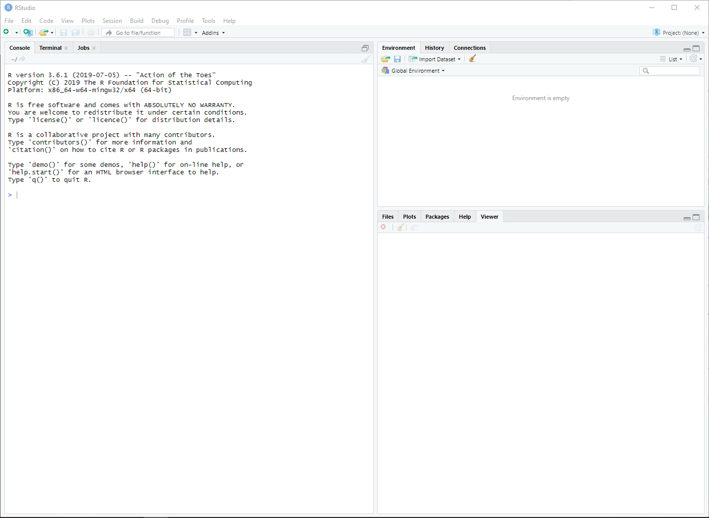

Due Friday, Aug 23 at 11:59pm.

# Welcome

## Meet the TA

{width="300"}

## Overview

-   Today's lab introduces the computing tools we will be using this semester.

-   We will begin by installing R and RStudio, and familiarizing ourselves with its basic functionality.

-   We will also introduce R Markdown as a tool to create high-quality reproducible reports - don't worry, a fillable template is provided.

**This is an individual lab. Your TAs will guide you through the first portion of the lab (until the "On your own" section).**

## Installation

R is a statistical programming language used for computation, data analysis, and graphics generation. It is widely used by statisticians, data scientists, and applied researchers in many fields.

### Benefits of R

-   flexible and freely available to the public, who have in turn written many user-contributed **packages** which provide additional functionality.

-   RStudio is a convenient interface for R that adds convenient features, such as exporting output in nice formats.

-   In this class, we'll be doing all of our computation in RStudio.

Let's begin by installing R and RStudio. First, we need to install R, which can be [downloaded here](https://cran.r-project.org/) (see screenshot below).


Next, install RStudio Desktop, which can be [downloaded here](https://posit.co/download/rstudio-desktop/) (see screenshot below).


## First Steps in RStudio

With R and RStudio installed, we'll begin by exploring RStudio: the interface, reading in data, and basic commands. Upon opening RStudio, you should see something similar to the window below:



The **console** is the panel on the left side, and is where users can type commands and see immediate output. Let's try it out! Type the following code into the console:

```{r echo = T, eval = F}
3 + 5
```

You should get output that looks like

```{r echo = F}
3 + 5
```

(For now, ignore the `[1]`). By typing in `3+5`, we got the expected answer, `8`. We can see that R can be used as a calculator directly in the console. Try some other commands that use R as a calculator. For instance, `3*25`, `exp(2)`, or `(10+5^2)/sqrt(40)`. Of course, R is not simply a calculator; other commands may also be entered here.

To illustrate, let's load a dataset. Enter the following command into the console (you can directly copy/paste it, but make sure everything is exactly as below):

```{r echo = T, long_output}
cdc <- read.csv("https://karamccor.github.io/b600-f24/labs/data/cdc_cleaned.csv")
```

We've just loaded a dataset named `cdc`. These data come primarily from the Sortable Risk Factors and Health Indicators dataset from the CDC, which comprises demographic and health indices compiled from various federal sources. This dataset is now part of our **environment**, which is displayed on the top half and right side of the RStudio window.

-   The environment contains all objects in the current working space. These objects could be variables, lists of variables, or even entire datasets.

-   In the same location as the environment tab, the **history tab** displays all commands used during the current session (don't worry about the connections tab for now).

-   Finally, the bottom half of the right-hand panel shows information regarding files on your hard drive, installed packages, output such as plots, and help files or other documents.

Coming back to the dataset we loaded in, we can see that it is named `cdc`. We can take a look at this dataset in a spreadsheet-like window by clicking on `cdc` in the Environment tab to the right, or by running the following code **in the console**:

```{r echo = T}
View(cdc)
```

Note that other objects may be added to the environment, either from external data sources from the internet as in today’s example, datasets downloaded to your computer, or even as created as manipulations of existing datasets.

## R Markdown and reproducible research

R Markdown is a system that may be used to create easy-to-write, attractive reports, presentations, or webpages that also serve as reproducible records of the data analysis. These reports have the desirable property of being able to not only display written narratives and figures, but also include any R code and the outputs from these code snippets.

One of the biggest strengths of R Markdown is that everything is in one place, and that other users should be able to reproduce your results exactly, if they have your R Markdown document and datasets - the analysis is run from the beginning each time you render the document. As well, formatting is easy! Luckily, RStudio already comes with R Markdown support, so there is nothing additional to install.

Every homework assignment and lab in this class will be written in R Markdown, with a template provided for you to use. This lab's template can be downloaded by typing in the following code:

```{r eval = F}
download.file("https://karamccor.github.io/b600-f24/labs/lab-00-template.Rmd", destfile="lab-00.Rmd")
```

You should now see the new file `lab-00.Rmd` under the Files tab in the bottom-right hand side of your RStudio window. Click on `lab-00.Rmd` in this window in order to open it up – it is the template for use in this lab!

First, put your name in the space at the top where it says "YOUR NAME GOES HERE".

Fill in answers in the spaces provided: text narrative should be typed directly in the document and any included R code should be typed inside “chunks,” or sections defined by three backticks (the little mark on the same key as the tilde). See the template for more instructions, or ask your TA.

## At the end, here's how you'll turn this in:

- "Knit" the .Rmd file to an html file, by clicking on the blue knit button at the top of this window. (Demo) 

- Open the .html document in any browser, and print to pdf. You'll turn in the .pdf file to Canvas under Assignments. 

## Back to the lab

For this lab, we will take a look at a built-in R dataset called `mtcars`. The data was extracted from the 1974 Motor Trend US magazine, and comprises fuel consumption and 10 aspects of automobile design and performance for 32 automobiles (1973–74 models).

You'll see the following code in a "code chunk" in your template. To run the entire chunk, click the green arrow towards the top right of the code chunk. 
```{r}
# Load in the data
data(mtcars)

# Print the first 6 rows
head(mtcars, 6)
```

# On your own

## Exercise 1

How many `mpg` does the Mazda RX4 have, in the first row of the dataset?

## Turning in your assignment

## From .html to .pdf

In order to turn in your RMarkdown document, you should **knit** the template into an .html file (blue yarn ball at the top of the window) that can be opened by any web browser. To export it as a .pdf, open the file in your web browser and then print to or save as a .pdf document. Your TA will show you how if you need help! (There is a way to directly knit to a .pdf file, but it’s quite a bit more involved.)

Important: You must turn in a .pdf file corresponding to the R Markdown template to Canvas in order to receive credit for the labs and homework assignments.